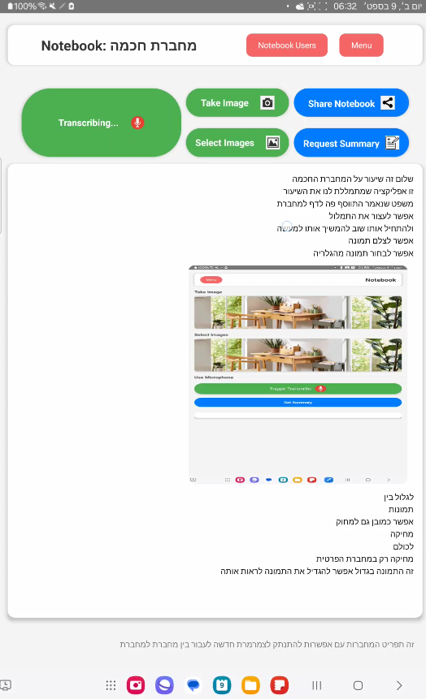
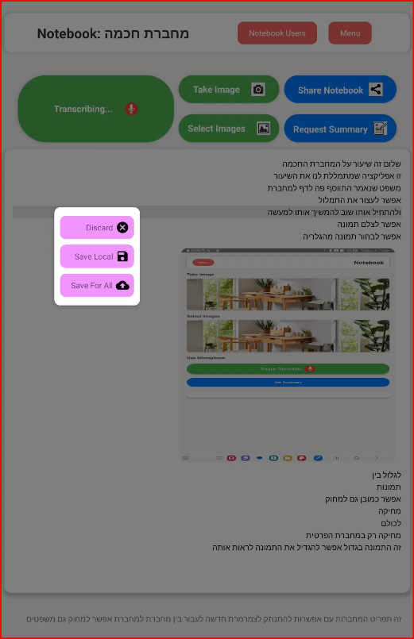
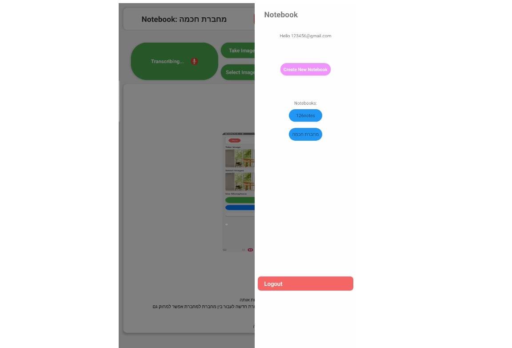
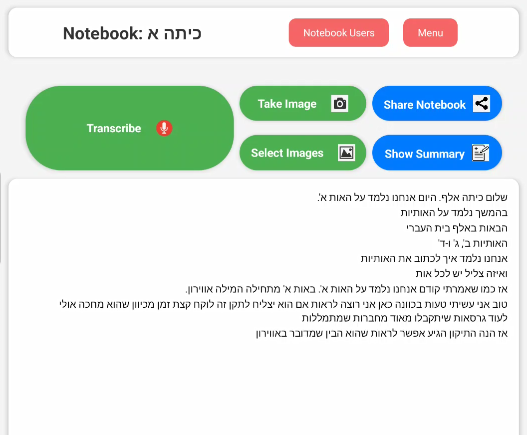

# Smart Social Notebook 🎓📱

An intelligent social platform for collaborative academic note-taking, featuring real-time transcription, AI-powered content enhancement, and seamless sharing capabilities.

## 🚀 Project Overview

The Smart Social Notebook is a comprehensive solution revolutionizing how students capture, process, and share academic content. This innovative application combines cutting-edge AI technology with social collaboration features to create a powerful learning ecosystem.

## ✨ Key Features

• **🎤 Real-time Transcription**: Automatic speech-to-text conversion in Hebrew and English  
• **🤖 AI-Powered Enhancement**: Content improvement and summarization using Claude AI  
• **📸 Visual Integration**: Camera capture and image upload capabilities  
• **👥 Social Collaboration**: Real-time synchronization between multiple users  
• **📚 Shared Notebooks**: Collaborative note-taking with permission management  
• **🔄 Live Sync**: Firebase-powered real-time data synchronization  

## 🛠️ Technical Architecture

### Frontend
• **React Native**: Cross-platform mobile development  
• **React Native Voice**: Speech recognition and transcription  
• **React Native Image Picker**: Camera and gallery integration  

### Backend & AI
• **Python Server**: Core processing and AI integration  
• **Claude AI (Anthropic)**: Advanced text processing and summarization  
• **Firebase Realtime Database**: Real-time data synchronization  
• **Firebase Storage**: Image and file management  
• **Firebase Authentication**: Secure user management  

### Key Technical Achievements

#### 🎯 Advanced AI Integration
• Custom Claude AI implementation for text enhancement  
• Intelligent content summarization with context preservation  
• Multi-language support (Hebrew/English)  
• Prompt engineering for optimal results  

#### 🔄 Real-time Synchronization
• Multi-user concurrent transcription handling  
• Conflict resolution for simultaneous edits  
• Efficient data flow management  
• Live collaboration features  

#### 📱 Cross-platform Performance
• Optimized React Native implementation  
• Responsive design for various screen sizes  
• Offline capability support  
• Seamless user experience  

## 🏗️ System Architecture

```
┌─────────────────┐    ┌──────────────────┐    ┌─────────────────┐
│   React Native  │    │   Python Server  │    │   Claude AI     │
│   Mobile App    │◄──►│   Processing     │◄──►│   Enhancement   │
└─────────────────┘    └──────────────────┘    └─────────────────┘
         │                       │
         │                       ▼
         │              ┌──────────────────┐
         │              │   Firebase       │
         ├─────────────►│   Realtime DB    │
         │              └──────────────────┘
         │
         ▼
┌──────────────────┐
│   Firebase       │
│   Storage        │
└──────────────────┘
```

## 📊 Performance & Testing

### AI Model Evaluation
I conducted comprehensive testing of the Claude AI model's performance:
• **Dataset**: Computer science lecture transcriptions  
• **Metrics**: Text accuracy, error correction, content preservation  
• **Results**: High accuracy in error detection and correction with excellent context retention  

### Quality Metrics
• **Transcription Accuracy**: Real-time speech recognition with noise filtering  
• **AI Enhancement**: Intelligent text improvement and grammatical correction  
• **Synchronization**: Real-time updates across multiple devices  
• **User Interface**: Intuitive design tested across multiple Android devices  

## 🚀 Installation & Setup

### Prerequisites
• Android 8.0 or higher  
• Internet connection  
• Microphone and camera permissions  

### Quick Start
```bash
# Clone the repository
git clone https://github.com/smartNotebookProjectOrg/transcribe_lecture.git

# Navigate to project directory
cd transcribe_lecture

# Install dependencies
npm install

# Start the application
npm start
```

### Environment Setup
Follow the React Native environment setup guide: https://reactnative.dev/docs/set-up-your-environment

## 💡 Core Functionality

### 1. Notebook Management
• Create and join collaborative notebooks  
• Advanced permission system  
• User role management  

### 2. Content Creation
• **Audio Recording**: High-quality lecture recording  
• **Real-time Transcription**: Instant speech-to-text conversion  
• **Image Integration**: Camera capture and gallery uploads  
• **Content Editing**: Manual text editing capabilities  

### 3. AI Enhancement
• **Text Improvement**: Grammar and style correction  
• **Intelligent Summarization**: Context-aware content condensation  
• **Error Detection**: Automatic transcription error identification  

### 4. Social Features
• **Real-time Collaboration**: Multiple users contributing simultaneously  
• **Content Synchronization**: Instant updates across all devices  
• **Shared Libraries**: Collective knowledge building  

## 🔧 Technical Challenges Solved

### Multi-user Synchronization
• Implemented efficient conflict resolution algorithms  
• Designed priority-based update queuing system  
• Created seamless real-time collaboration experience  

### AI Integration Optimization
• Custom prompt engineering for educational content  
• Implemented context-aware processing  
• Optimized API calls for performance  

### Cross-platform Compatibility
• Unified codebase for multiple Android versions and future iOS support  
• Responsive design implementation  
• Performance optimization for various hardware configurations  

## 🎯 Future Enhancements

• **iOS Support**: Expand to Apple ecosystem  
• **OCR Integration**: Text recognition from uploaded images  
• **Enhanced Security**: Content encryption and advanced privacy controls  
• **Multi-language Expansion**: Support for additional languages  

## 🏆 Project Impact

This application addresses critical challenges in modern education:
• **Accessibility**: Makes lectures accessible to all students  
• **Collaboration**: Enables seamless knowledge sharing  
• **Efficiency**: Reduces time spent on manual note-taking  
• **Quality**: Provides AI-enhanced, high-quality study materials  

## 📱 Screenshots & Demo

### Main Notebook Interface

*Main notebook screen showing transcription controls, image capture, and content display*

### Action Menu Options

*Save and discard options for recorded content*

### Notebook Management

*Side menu for notebook selection and user management*

### Live Transcription Example

*Real-time transcription of Hebrew content during lecture*

**Key UI Features Demonstrated:**
• **Intuitive Controls**: Large, accessible buttons for recording and image capture
• **Real-time Feedback**: Live transcription display with Hebrew/English support  
• **Social Features**: User management and notebook sharing capabilities
• **Content Management**: Save, edit, and organize transcribed content
• **Professional Design**: Clean, modern interface optimized for academic use

## 🤝 Contributing

This project showcases advanced skills in:
• **Mobile Development**: React Native expertise  
• **AI Integration**: Claude AI implementation and optimization  
• **Backend Architecture**: Python server development  
• **Database Design**: Firebase real-time database implementation  
• **User Experience**: Intuitive interface design  
• **Problem Solving**: Complex synchronization and collaboration challenges  

## 📞 Contact

**Developer**: Odel Vinik  
**Email**: odel41222@gmail.com  
**LinkedIn**: [https://www.linkedin.com/in/odel-vinik-89645293](https://www.linkedin.com/in/odel-vinik-89645293?utm_source=share&utm_campaign=share_via&utm_content=profile&utm_medium=ios_app)  
**Project Repository**: 
- [Transcribe Lecture](https://github.com/OdelVi1/transcribe_lecture)
- [Smart Notebook Server](https://github.com/OdelVi1/smart_notebook_server)

---

*This project represents a comprehensive solution combining cutting-edge AI technology with practical educational needs, demonstrating advanced full-stack development capabilities and innovative problem-solving skills.*